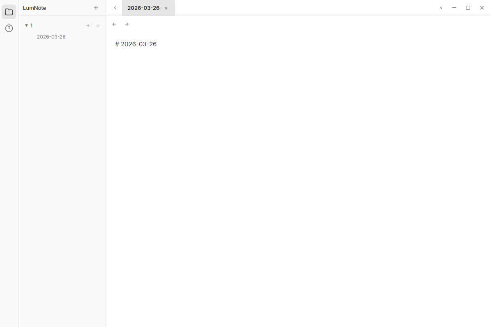

# LumNote

**本地优先，极简高效，专注 Markdown 知识管理。**

## Introduction

LumNote 是一款基于 Electron 的本地优先笔记应用，围绕项目笔记与暂存区（Inbox）双轨协作设计。应用支持双栏编辑、自动保存、跨项目链接跳转与附件管理，帮助你在记录灵感与结构化沉淀之间快速切换，同时保持数据可控与隐私安全。

## Features

- 双轨制笔记流：项目笔记 + 按日归档的 Inbox 协同编辑
- 双栏工作台：在同一视图中并行处理正式内容与临时想法
- `[[项目/笔记]]` Wiki 风格链接，支持自动补全与点击跳转/创建
- 本地优先存储策略，支持知识库路径切换与会话恢复
- 附件插入与导出能力，便于沉淀可迁移的 Markdown 资产

## Tech Stack

- Electron
- TypeScript / JavaScript
- Node.js
- AI SDK（可选，按需集成）

## Screenshots



> 请将上图替换为你的真实应用截图。

## Quick Start

```bash
git clone <repo-url>
npm install
npm start
```

## Environment Variables

当前代码扫描结果显示：**无强制环境变量**。  
如你后续接入 AI 或第三方服务，建议在 `.env` 中配置并通过 `process.env` 读取，例如：

```bash
OPENAI_API_KEY=your_key_here
AI_MODEL=your_model_here
```

## License

This project is licensed under the MIT License.

## Maintainer

- [Your Name]
