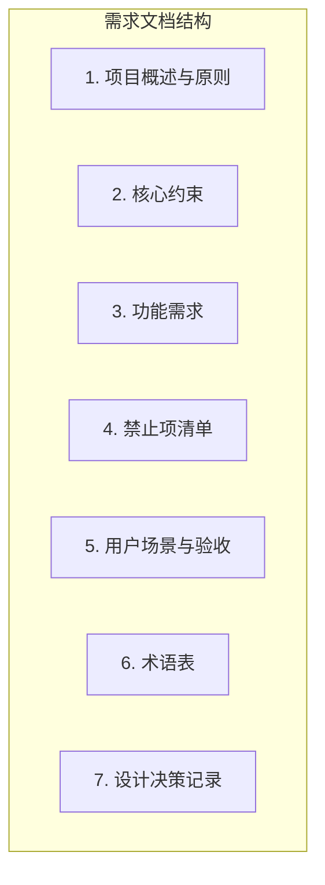

# Lumen 极简笔记应用 - 需求文档

## 文档结构



---

## 1. 项目概述与原则

### 产品定位

本地优先、极简、开箱即用的 Markdown 笔记应用。用户打开即用，无需学习成本。

### 黄金法则

每增加一个功能，必须先回答：

- 用户会因为这个功能而更专注地记录内容吗？
- 如果去掉这个界面元素，用户还能完成核心任务吗？

### 极简定义

极简不是功能少，而是每个功能都必要。

---

## 2. 核心约束

| 类别 | 约束 | 验收方式 |
|------|------|----------|
| 本地优先 | 无云端、无账号、无网络依赖 | 断网可用 |
| 目录结构 | 知识库路径见「跨平台路径」 | 首次启动自动创建 |
| 项目层级 | 严格两级：项目(文件夹) / 笔记(文件) | 文件系统禁止三级 |
| 编辑格式 | 仅 Markdown，无富文本 | 输出为 .md 纯文本 |
| 标签页 | 最多 6 个 | 超过时提示「已达到上限」 |
| 界面元素 | 无工具栏、状态栏、菜单栏 | UI 审计 |

### 跨平台路径

- **Windows**：`C:\LumenKnowledgeBase`
- **macOS / Linux**：`~/LumenKnowledgeBase`

### 6 个标签页行为

- 已打开 6 个时，再打开新笔记需先关闭一个
- 新建笔记时若已满，提示「已达到上限，请关闭一个标签页」后拒绝创建

---

## 3. 功能需求

### 3.1 启动与初始化

| 需求编号 | 需求描述 | 验收条件 |
|----------|----------|----------|
| REQ-001 | 首次启动自动创建知识库根目录（按跨平台路径） | 启动后目录存在 |
| REQ-002 | 若目录已存在，直接使用，不覆盖 | 已有文件/文件夹不被修改 |
| REQ-003 | 自动创建 `Inbox.md`（含默认模板）；若不存在则创建 | Inbox.md 存在且含默认内容（见附录 A） |
| REQ-004 | 自动创建 `Projects` 空文件夹；若不存在则创建 | Projects 文件夹存在 |
| REQ-005 | 不弹出路径选择、配置向导或注册对话框 | 首次启动无弹窗 |
| REQ-006 | 恢复上次会话：重启后恢复上次打开的标签页 | 关闭前打开的笔记，重启后自动打开 |

### 3.2 界面布局

| 需求编号 | 需求描述 | 验收条件 |
|----------|----------|----------|
| REQ-007 | 左栏固定宽度 250px，可折叠；仅显示「项目」「暂存区」 | 左栏仅此两项，可折叠 |
| REQ-008 | 右栏占屏幕约 75%；标签页模式 | 右栏为标签页区域 |
| REQ-009 | 右上角「双栏」按钮，切换为笔记+暂存区分屏 | 点击后进入双栏模式 |
| REQ-010 | 双栏模式：左栏=当前笔记，右栏=Inbox | 左右内容固定分配 |
| REQ-011 | 无工具栏、菜单栏、状态栏 | 界面无上述元素 |
| REQ-012 | Projects 为空时显示空白态提示：「在 Projects 下创建文件夹，或右键新建项目」 | 无项目时显示该文案 |

### 3.3 项目与笔记

| 需求编号 | 需求描述 | 验收条件 |
|----------|----------|----------|
| REQ-013 | 「项目」下列出 `Projects` 下所有一级文件夹 | 项目列表正确显示 |
| REQ-014 | 右键「项目」或空白处 →「新建项目」→ 输入名称 → 在 Projects 下创建文件夹 | 新建项目成功创建 |
| REQ-015 | 点击项目名：在右栏以标签页打开该项目下所有 .md 文件 | 点击后所有笔记以标签页打开 |
| REQ-016 | 项目内笔记按文件名排序（如 01_需求.md、02_设计.md） | 笔记列表按文件名排序 |
| REQ-017 | 右键项目 →「新建笔记」；或项目名旁显示极小「+」图标点击 | 两种方式均可新建笔记 |
| REQ-018 | 新建笔记：弹出输入框，默认「未命名.md」或「笔记_YYYYMMDD_HHmm.md」，用户可修改 | 可输入或使用默认名 |
| REQ-019 | 新建笔记后自动在右栏打开为新标签页 | 创建后立即打开 |
| REQ-020 | 若已有 6 个标签页，新建笔记时提示「已达到上限，请关闭一个标签页」并拒绝创建 | 满 6 个时无法新建 |
| REQ-021 | 笔记内 `[[项目名/文件名]]` 自动解析为可点击链接 | 点击可跳转 |
| REQ-022 | 输入 `[[` 时弹出项目/笔记列表供选择 | 自动补全可用 |
| REQ-023 | 点击 `[[ProjectX/新笔记]]` 时，若文件不存在则创建空 .md 并打开 | 链接到不存在的笔记时自动创建 |

### 3.4 暂存区

| 需求编号 | 需求描述 | 验收条件 |
|----------|----------|----------|
| REQ-024 | 暂存区对应 `Inbox.md`（位于知识库根目录） | 点击暂存区打开 Inbox.md |
| REQ-025 | 点击「暂存区」：在右栏打开 Inbox.md（作为普通标签页） | 行为与普通笔记一致 |
| REQ-026 | Ctrl+I 或 Ctrl+1 快速切换到暂存区 | 快捷键生效 |
| REQ-027 | 暂存区无独立面板，与项目笔记同样在标签页中管理 | 无额外 UI |
| REQ-028 | 选中 Inbox 中一段内容 → 右键「移动到项目 X」→ 追加到目标项目笔记末尾，并从 Inbox 中删除该段 | 移动功能正确执行 |

### 3.5 编辑体验

| 需求编号 | 需求描述 | 验收条件 |
|----------|----------|----------|
| REQ-029 | Markdown 编辑，支持系统快捷键 Ctrl+C/V、Ctrl+Z/Y | 复制粘贴撤销恢复可用 |
| REQ-030 | 编辑时自动保存（如 500ms 防抖），同时支持 Ctrl+S 手动保存 | 编辑后内容不丢失 |
| REQ-031 | 无应用内额外编辑按钮 | 仅依赖系统快捷键 |

### 3.6 标签页

| 需求编号 | 需求描述 | 验收条件 |
|----------|----------|----------|
| REQ-032 | 标签悬浮显示关闭图标；或鼠标中键点击标签关闭 | 可关闭标签页 |
| REQ-033 | 最多 6 个标签页，超出时需关闭一个才能打开新的 | 数量限制生效 |

### 3.7 边界与异常

| 需求编号 | 需求描述 | 验收条件 |
|----------|----------|----------|
| REQ-034 | 知识库已存在时直接使用，不覆盖 | 不破坏已有数据 |
| REQ-035 | Inbox.md 被删除时自动重新创建含默认模板的 Inbox.md | 访问暂存区时自动恢复 |
| REQ-036 | Projects 为空时显示空白态提示 | 符合 REQ-012 |
| REQ-037 | 磁盘无权限时提示错误，不崩溃 | 友好错误提示，应用不崩溃 |

---

## 4. 禁止项清单

以下功能明确不可实现：

| 禁止项 | 说明 |
|--------|------|
| 云端同步 | 违背「本地优先」原则 |
| 三级及以上文件夹结构 | 违背「极简」原则 |
| 超过 6 个标签页 | 造成认知过载 |
| 富文本编辑器 | 增加复杂度 |
| 设置页面 | 需要学习成本 |
| 搜索功能 | 90% 用户不需要 |

---

## 5. 用户场景与验收标准

### 典型场景 A：写项目笔记时临时记录点子

1. 打开 Lumen → 自动看到 Inbox 和 Projects
2. 写 `ProjectX/01_需求.md` 时想到点子
3. Ctrl+I 或点击「暂存区」→ 右栏打开 Inbox.md
4. 输入内容（自动保存）
5. 继续写当前笔记
6. 选中 Inbox 内容 → 右键「移动到项目 ProjectX」完成整理

### 典型场景 B：新建项目与笔记

1. 右键「项目」→「新建项目」→ 输入「MyProject」
2. 右键 MyProject →「新建笔记」→ 输入「01_想法.md」
3. 自动在右栏打开新建笔记

### 验收标准（自然语言）

- 界面仅两栏：左导航（可折叠）+ 右编辑
- 无需操作即可看到 Inbox 和 Projects
- 点击「暂存区」或 Ctrl+I 立即打开 Inbox.md
- 右键项目可新建笔记，右键可新建项目
- 笔记内 `[[...]]` 自动生成链接，输入 `[[` 有补全
- 编辑自动保存，支持 Ctrl+S
- 重启后恢复上次标签页
- 无法创建三级文件夹
- 无设置页、无云端依赖
- 所有笔记为纯 Markdown，可用记事本打开

---

## 6. 术语表

| 术语 | 定义 |
|------|------|
| 知识库 | 笔记根目录（LumenKnowledgeBase） |
| 项目 | Projects 下的一级文件夹 |
| 笔记 | 项目文件夹内的 .md 文件 |
| 暂存区 | Inbox.md，用于临时记录 |

---

## 7. 设计决策记录

| 决策 | 原因 |
|------|------|
| 禁止搜索 | 90% 用户不需要，增加复杂度 |
| 6 个标签页 | 避免认知过载（原 10 个） |
| 无设置页 | 降低学习成本，开箱即用 |
| 自动保存 | 减少丢稿，无需显式保存按钮 |
| 从 Inbox 移动到项目 | 优化整理流程，减少手动复制粘贴 |

---

## 附录 A：Inbox.md 默认模板

```markdown
# 暂存区

在此记录临时想法，稍后整理到项目中
```

---

## 变更记录

| 版本 | 日期 | 变更说明 |
|------|------|----------|
| v1.0 | - | 初始版本 |
